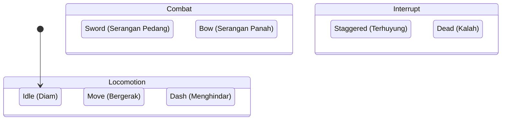
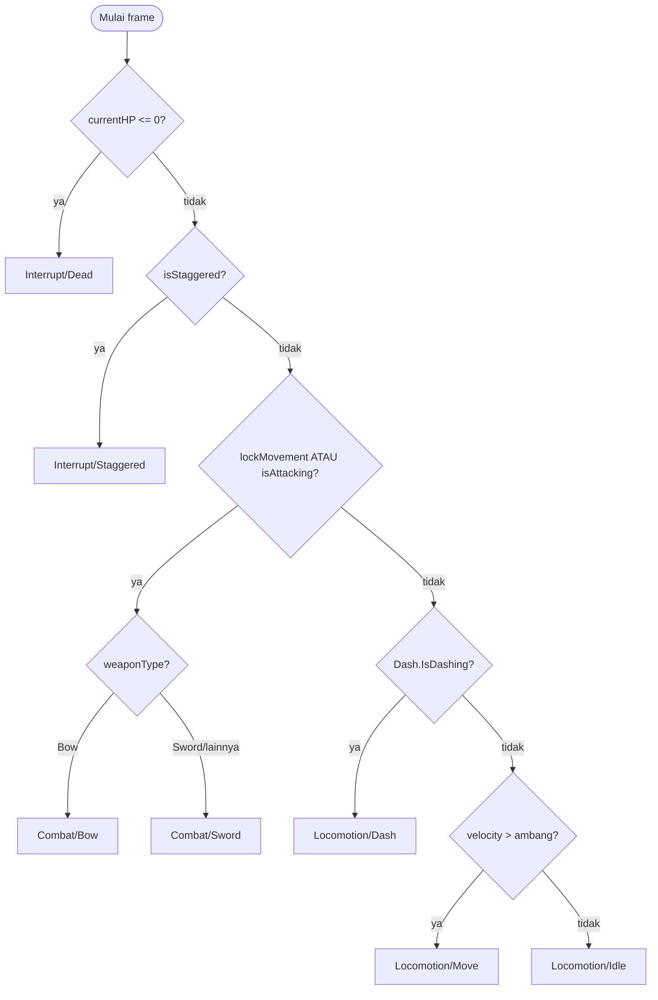

# Diagram HFSM Pemain

Dua sudut pandang: **(1) hierarki state** dan **(2) alur keputusan transisi
per-frame**. Keduanya akurat terhadap kode di `Assets/Scripts/Player/StateMachine/`.

> Cara render jadi gambar untuk buku: buka file ini di VS Code (extension
> *Markdown Preview Mermaid* / GitHub), atau tempel blok ```mermaid``` ke
> <https://mermaid.live>, lalu export PNG/SVG.

---

## 1. Hierarki State (struktur HFSM)



ASCII:

```
HFSM PEMAIN
│
├── Locomotion (super)          [hijau]
│     ├── Locomotion/Idle       "Diam"
│     ├── Locomotion/Move       "Bergerak"
│     └── Locomotion/Dash       "Menghindar (Dash)"
│
├── Combat (super)              [oranye]
│     ├── Combat/Sword          "Serangan Pedang"
│     └── Combat/Bow            "Serangan Panah" (charge Full Draw via pemicu)
│
└── Interrupt (super)           [merah]
      ├── Interrupt/Staggered   "Terhuyung"
      └── Interrupt/Dead        "Kalah"
```

---

## 2. Alur Keputusan Transisi (dievaluasi tiap `Update`)

Transisi memakai **prioritas** (cek dari atas; yang pertama cocok menang).
Ini cerminan langsung `SelectTargetState()` + `SelectCombatSubState()`.



ASCII (urutan prioritas):

```
1. currentHP <= 0 .................... Interrupt/Dead
2. isStaggered ....................... Interrupt/Staggered
3. lockMovement | isAttacking ........ Combat:
        a. weaponType == Bow ......... Combat/Bow  (charge Full Draw lewat pemicu)
        b. selain itu ................ Combat/Sword
4. Dash.IsDashing .................... Locomotion/Dash
5. velocity > ambang ................. Locomotion/Move
6. (default) ......................... Locomotion/Idle
```

---

## 3. Catatan baca

- **Super-state** (Locomotion/Combat/Interrupt) tidak pernah menjadi state
  aktif sendiri — hanya pengelompokan + jalur (`FullPath`).
- Mesin **selalu** mendarat di salah satu *leaf state* (kotak di diagram).
- Sifat **observasional**: HFSM membaca kondisi lalu menyimpulkan state; ia tidak
  mengubah gameplay. Lihat `LAPORAN_IMPLEMENTASI_HFSM.md`.
